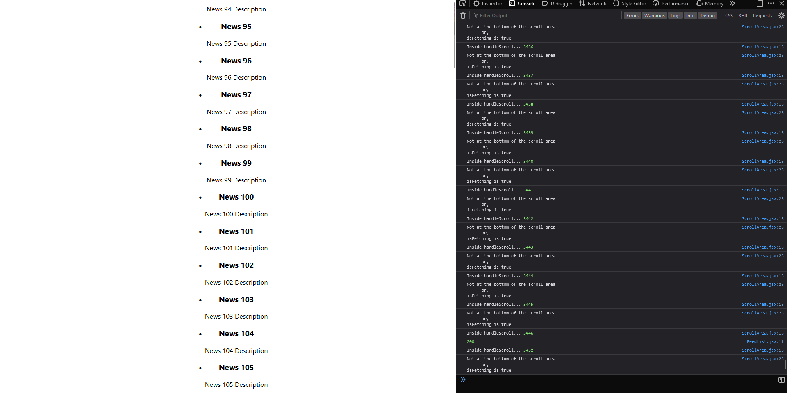

# Inf-Scrolling

This is a simple example of infinite scrolling using ReactJs and Flask server at the backend generating some dummy data infinitely.

## How to run

1. Clone the repository
2. Install the dependencies using `npm install`
3. Run the server using `npm start`
4. Open the browser and go to `localhost:3000`

## How to run the server

1. Go to the server directory
2. Install the dependencies using `pip install -r requirements.txt`
3. Run the server using `flask run` or `python app.py`

## Demo Image of the application

_warning: pretty gross image ahead!_

